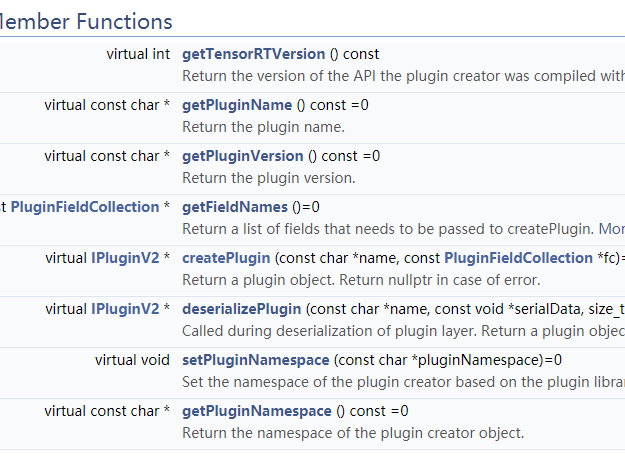
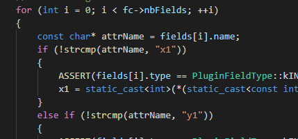
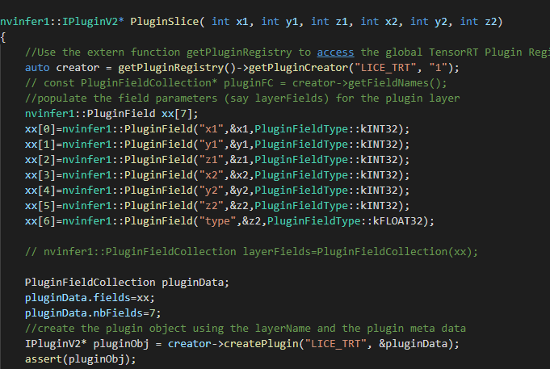
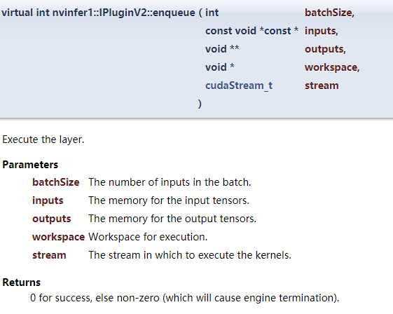
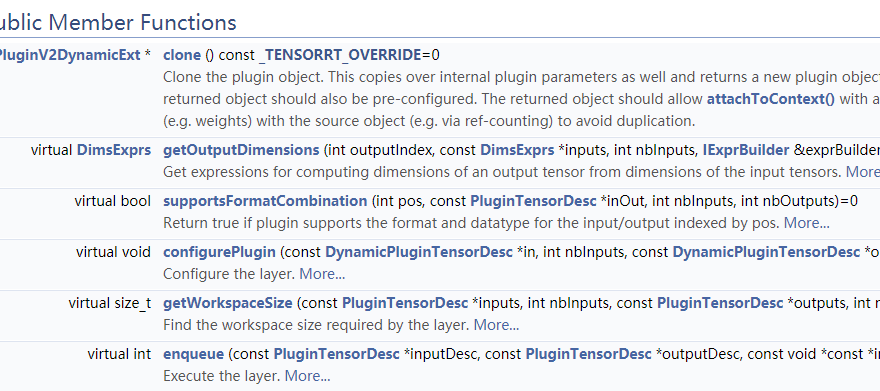

# plugin文档说明
plugin需要写2个类，一个是IPluginCreator ，将参数传入new plugin。另一个就是IPluginV2。
## IPluginCreator  
需要将一下虚函数重写：

createPlugin(const char* name, const PluginFieldCollection* fc)
是创建plugin的接口。在PluginFieldCollection* fc中，fc的参数的顺序要按照循环里面的顺序去放入:

新建IPluginCreator的接口时候，需要按照顺序放入vector中:

最后记得注册一下Plugin：REGISTER_TENSORRT_PLUGIN(yourpluginCreator);

## IPluginV2
目前最新的plugin都是按照这个类做为基类。最新的类是IPluginV2IOExt和IPluginV2DynamicExt。

### IPluginV2IOExt
IPluginV2IOExt比较重要的几个函数：

supportsFormatCombination这个函数是确定输入输出tensor的格式。通过pos作为索引，来确定plugin所支持的不同type和format。如果格式不确定，或者格式与plugin不符合，则会导致错误。

enqueue是infer中调用的函数。通过这个函数，去实现如何计算这个plugin的过程。

enqueue中需要调用CUDA的代码，注意需要batchsize和数据维度输入到CUDA中

函数isOutputBroadcastAcrossBatch():如果返回TRUE表示输出的数据可以通过广播的形式进行输出。即隐式的表明batshsize只能为1。

函数canBroadcastInputAcrossBatch：如果输入的数据是重复的，可以只输入一次的tensor。**目前在这个类里面，没有发现调用。**

### IPluginV2DynamicExt
需要将一下虚函数重写：

由于IPluginV2DynamicExt是动态的输入，依据网络输入的tensor的shape去进行计算，所以getOutputDimensions 和enqueue等这些需要在输入后确定输入输出的tensor的shape。

IPluginV2DynamicExt和IPluginV2IOExt的enqueue区别在与输入的尺寸是在enqueue里面确定的。而且没有了batchsize，所以inputDesc这个参数去获取输入的尺寸。而且需要使用builder->createNetworkv2(flags)这个接口去进行创建。

enqueue(const nvinfer1::PluginTensorDesc* inputDesc,
    const nvinfer1::PluginTensorDesc* outputDesc, const void* const* inputs, void* const* outputs, void* workspace,
    cudaStream_t stream)

enqueue函数在传入数据的之后，所得的tensor是包含batchsize的数据，所有需要考虑batchsize的维度和大小，之后放入gpu中进行处理。

这个类只能采用**builder->createNetworkv2(flags)**去创建。采用builder->createNetwork()创建网络，batchsize是隐式定义的。在addIlayer的时候，需要注意输入输出没有batchsize的维度。而builder->createNetworkv2的batchsize是显式定义的。在addIlayer的时候，需要注意输入输出必须包含batchsize的维度。

## CMAKE文件
每一个Plugin都有一个CMakeLists
在add_executable(OCRTrt *.h *.cpp  plugin.h kernel.h ${COMMON} test1.cpp )去添加所需要编译的code。

如果需要编译.so文件，则需要在add_library()添加，并注销掉在add_executable。最终版本要set(CMAKE_BUILD_TYPE Debug)改为release。

## test1.cpp文件
采用API构建网络的方法。
nvinfer1::IPluginV2* PluginSlice( int x1, int y1, int z1, int x2, int y2, int z2) 是新建plugin类。用network->addPluginV2()添加到网络中。

